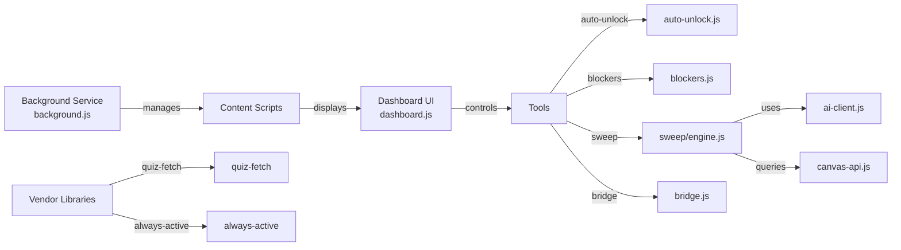

# FEU Canvas Suite

An all-in-one Chrome extension companion for FEU Canvas that provides pending-work dashboards, automated module management, configurable discussion replies, and quiz utilities—all toggle-able from a unified dashboard.

## Features

- **Pending-Work Dashboard**: Visualize all pending assignments, discussions, and quizzes at a glance
- **Canvas Quiz Fetcher**: Export and manage quiz questions
- **Always-Active Tab Override**: Keep tabs marked as active despite inactivity
- **Discussion Reply Automation**: Support for manual, template, AI-assisted, and auto-reply modes
- **Configurable Settings**: Enable/disable individual features from the dashboard
- **Unified Extension Dashboard**: Single entry point for all Canvas-related tools

## Architecture (UML)

## Tech Stack

- **Platform**: Chrome Web Extension (Manifest V3)
- **Runtime**: JavaScript (ES6+)
- **Storage**: Chrome storage API
- **Content Injection**: Isolated world + messaging bridge

## Getting Started

### Installation

1. Clone or download the repository
2. Open `chrome://extensions` in your Chrome browser
3. Enable **Developer mode** (top-right toggle)
4. Click **Load unpacked** and select the `extension` folder

### Usage

1. Click the extension icon in the Chrome toolbar to open the dashboard
2. Navigate to any Canvas course or assignment page
3. The extension will automatically detect the context and enable relevant features
4. Toggle individual tools on/off in dashboard settings
5. For quiz fetching, open a quiz page and use the dedicated button

### Configuration

Each tool can be individually enabled/disabled in the dashboard:
- Auto-unlock pending tabs
- Block/filter specific content
- Enable sweep automation
- Configure discussion reply templates

## Development

### Project Structure

- `extension/` — Main extension directory
  - `manifest.json` — Extension configuration
  - `background.js` — Service worker (event handling)
  - `dashboard.js` — Dashboard UI renderer
  - `tools/` — Individual feature modules
    - `sweep/` — Module automation engine
    - `auto-unlock.js` — Tab state management
    - `blockers.js` — Content filtering
  - `vendor/` — Third-party libraries

### Building for Distribution

1. Zip the `extension` folder
2. Upload to Chrome Web Store or distribute as CRX

## Known Limitations

- Only works on FEU's Canvas instance and compatible Instructure sites
- Some features require active user interaction for security reasons
- AI-based replies depend on external API availability

## Future Enhancements

- Sync settings across browser profiles
- Dark mode support
- Grade prediction and analytics
- Calendar integration